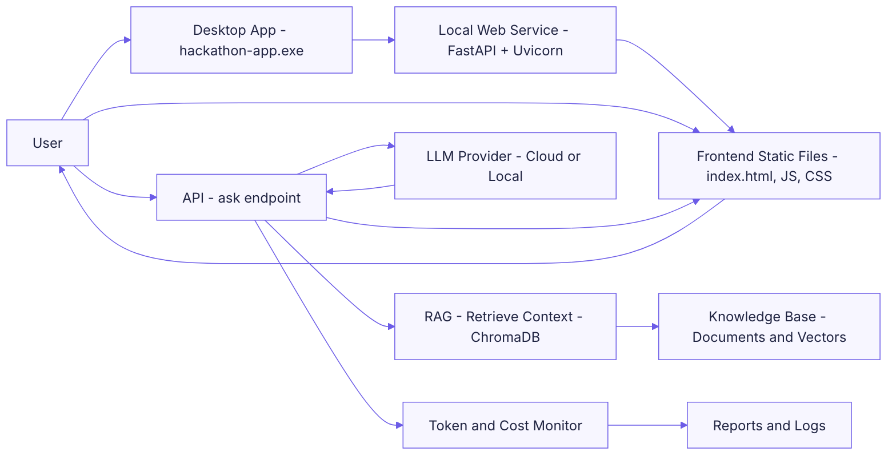
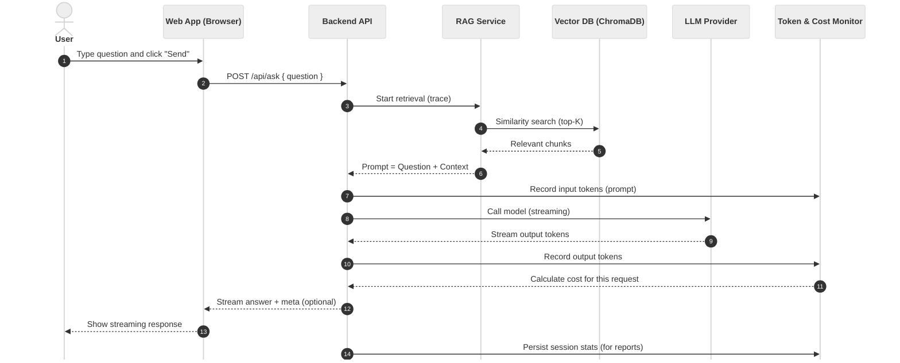
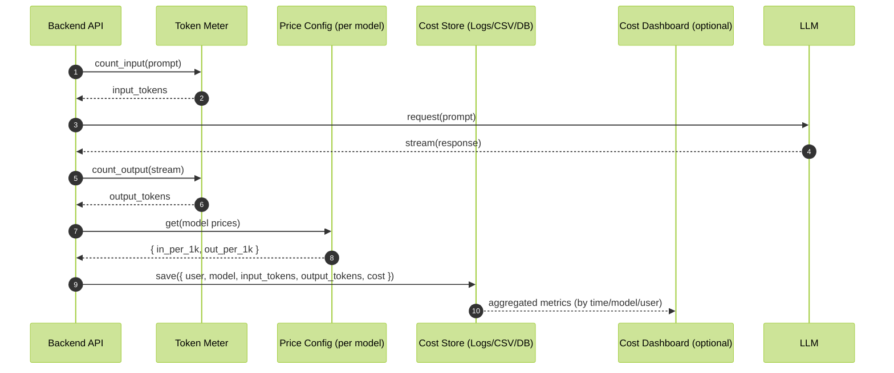
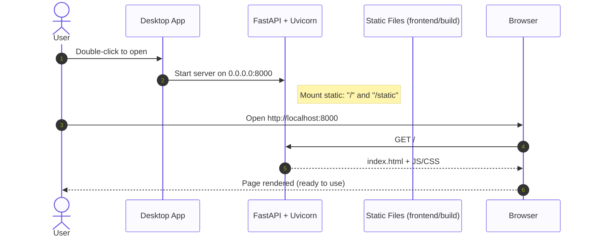
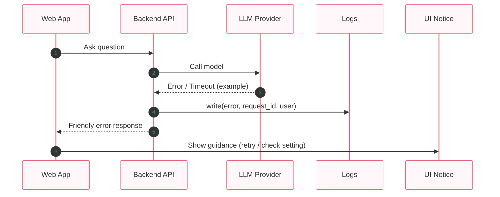

<!--
Service Journey — Business Friendly
This page explains how the service works in a simple and visual way for business users.
Brand color palette (editable):
- Brand Primary: #6C5CE7
- Brand Secondary: #A8A4FF
- Surface: #F7F6FF
-->

  

<h1 align="center">Service Journey — Business Friendly</h1>

<strong>Simple overview, business-first visuals, token & cost awareness</strong>

---

## A. Big Picture (Overview)

- You open the desktop app (hackathon-app.exe).
- A local web service starts on your computer (localhost:8000).
- The service directly serves the web page.
- You ask a question; the system retrieves relevant knowledge (RAG) and calls the AI model.
- The answer streams back to the page.
- Tokens are counted and costs are estimated automatically.

---

## B. End-to-End Journey (Simple Sequence)

- User action → Web App → RAG → Model → Streaming answer.
- Token and cost are recorded during the process.

---

## C. Token & Cost Monitoring (Per Request)

- We measure “input tokens” (prompt) and “output tokens” (model response).
- Cost = price_in × (input_tokens/1K) + price_out × (output_tokens/1K).
- Pricing is configurable per model and can be updated anytime.
- Data can be aggregated by user, model, date, or project.

---

## D. System Startup & Static Site Serving

- The program starts a local service; you open the browser yourself.
- The page and assets are served locally for a smooth experience.
- FastAPI also provides a handy API page at /docs.

---

## E. Failure & Recovery (Business View)

- If the model or network fails, the system shows a friendly message and logs details for support.
- Your data and previous sessions remain safe.

---

## Quick Reminders (for Business Users)

- Open the app, then visit: http://localhost:8000
- API reference (for internal use): http://localhost:8000/docs
- Costs are tracked automatically by tokens and model price.
- Reports can be exported and viewed as dashboards.

<em>Brand color: #6C5CE7 (editable)</em>
